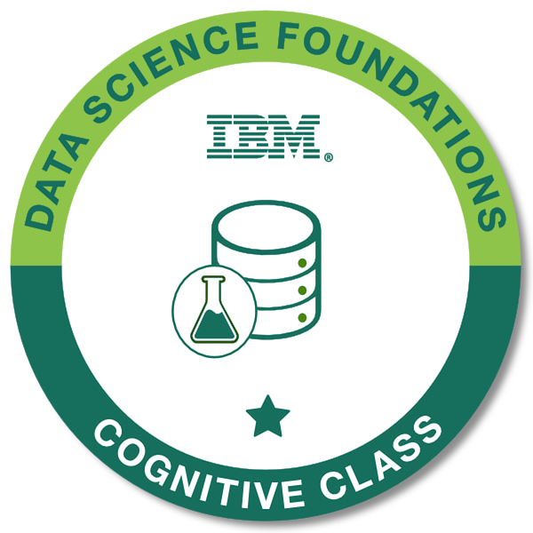
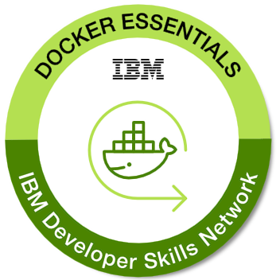
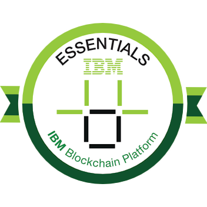
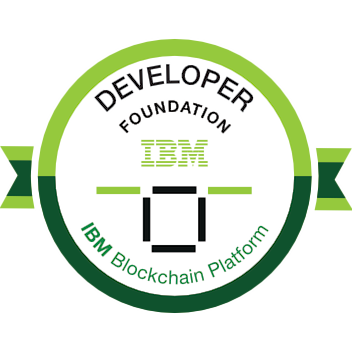
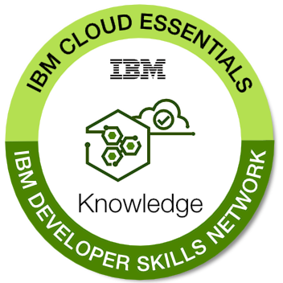
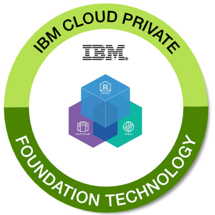
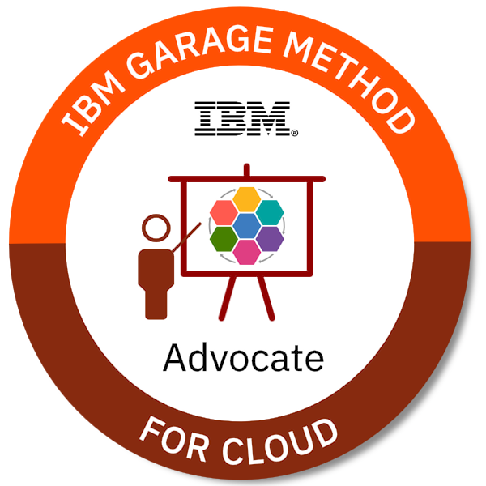
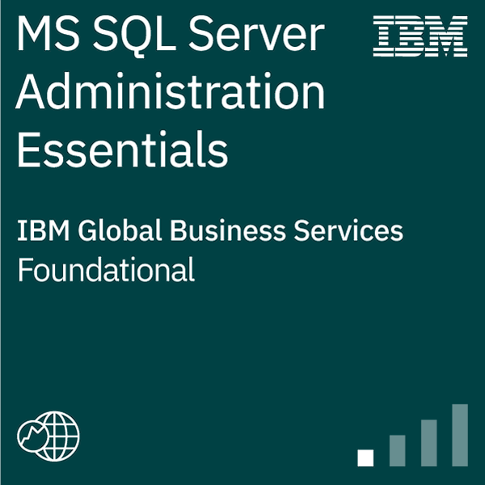
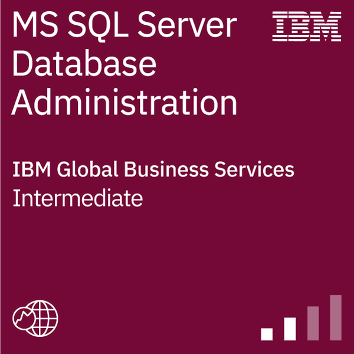

Hi 👋 My name is Paweł Domański
===============================

Administrator Systemów Baz Danych
---------------------------------

I have over 25 years of experience in both Oracle and Microsoft SQL Server database administration. Very good knowledge of issues related to the architecture, installation, and management of databases both in project management, as well as everyday support for users and development teams. Very good knowledge of high availability tools (RAC in Oracle, AlwaysOn in SQL Server), and backup systems such as IBM Spectrum Protect or NetWorker.Knowledge of programming and application servers allows me to solve problems faster. In many projects, my insight in solving problems and open approach can be an invaluable help in new challenges.

* 🌍  I'm based in Poland
* ✉️  You can contact me at [pawel@dexterlab.pl](mailto:pawel@dexterlab.pl)
* 🚀  I'm currently working on [Kyndryl](http://kyndryl.com)
* 🧠  I'm learning Python, Machine Learning, Data Science

### Skills

 

### Socials

     

### Badges

  

<b>My GitHub Stats</b>

